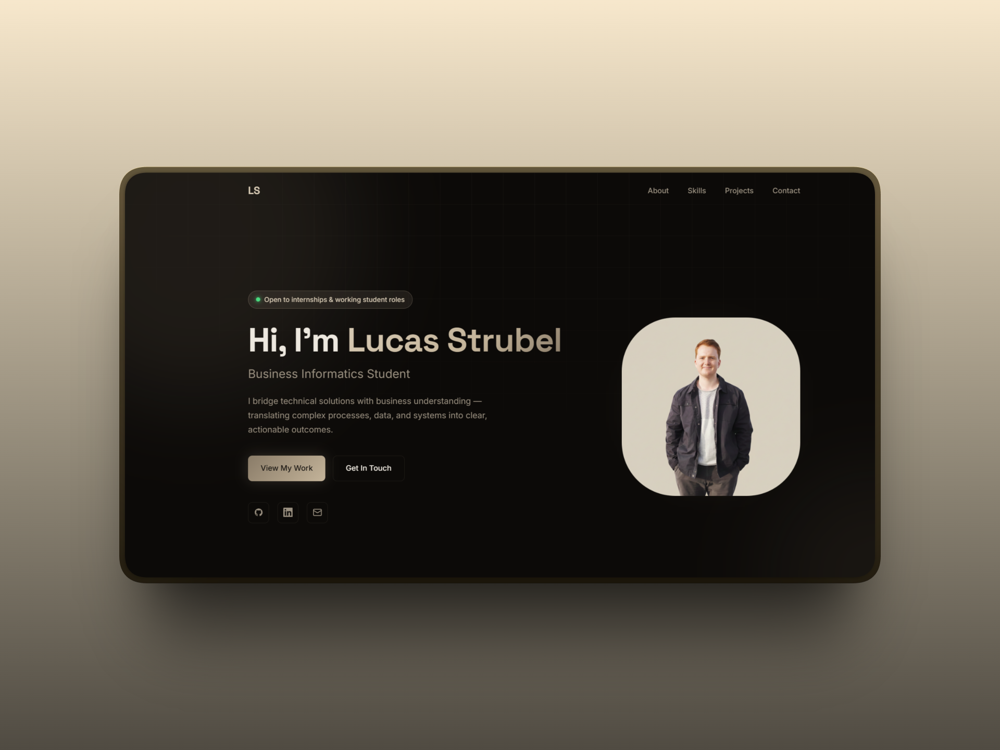

# Portfolio

Live site: lucasstrubel.github.io

## About this project

A personal portfolio built from scratch using HTML, CSS, and vanilla JavaScript — without frameworks or templates. My goal was to create a modern, fully responsive site while staying close to the fundamentals. By writing every line myself, I deepened my understanding of how each part works together and strengthened the foundation I rely on when building more complex projects.

## What's inside

- **Responsive layout** — CSS Grid + Flexbox with a mobile hamburger menu
- **Scroll animations** — IntersectionObserver reveals with staggered card entrances
- **Active nav highlight** — nav link updates automatically as you scroll through sections
- **Project detail pages** — dedicated pages for each featured project under `projects/`
- **Dynamic footer** — current year injected via JavaScript
- **Google Fonts** — Inter + Space Grotesk loaded via preconnect for fast rendering

## What I learned

- **Vanilla JS discipline** — managing scroll events, IntersectionObserver, and DOM manipulation without a library makes you appreciate exactly what frameworks abstract away
- **CSS architecture** — structuring a stylesheet with custom properties and utility patterns keeps things maintainable without a preprocessor
- **Performance basics** — using `passive` scroll listeners, `preconnect` for fonts, and lazy reveals via IntersectionObserver instead of scroll event polling
- **Deployment** — publishing on GitHub Pages and understanding how static hosting, caching, and DNS fit together

## Preview

## Tech

HTML · CSS · JavaScript · GitHub Pages